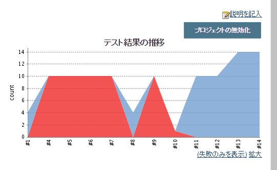
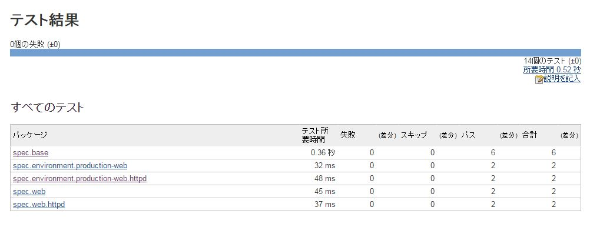
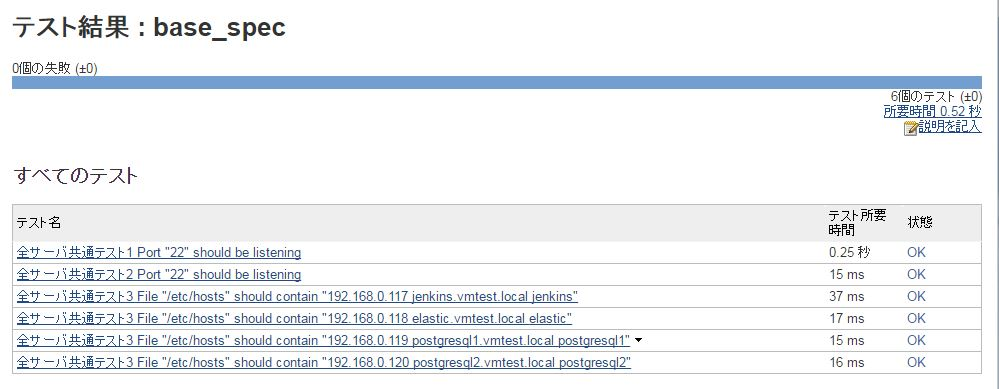

# Zabbixからテスト対象のホスト情報を動的に取得する

zabbixのAPI（host.get）を使ってその時点でどのサーバがどのホストグループ(roles)
に属しているかという情報を取得する。これにより新規サーバやロール変更・追加などによるテスト漏れを防ぐ  

```
cat hosts.json |jq .
[
  {
    "name": "proapp01.vmtest.com",
    "roles": [
      "Discovered hosts",
      "production-app"
    ]
  },
  {
    "name": "proapp02.vmtest.local",
    "roles": [
      "Discovered hosts",
      "production-app"
    ]
  },
  {
    "name": "staapp01.vmtest.local",
    "roles": [
      "Discovered hosts",
      "staging-app"
    ]
  }
]
```
上記の例では、  
"proapp01.vmtest.com"は  
"Discovered hosts"  
"production-app"  
というロールに属しているのでそれに対応したテストが実行される。

# specファイルのディレクトリ構成  
specファイルは"spec"ディレクトリ下に配置される  
例えば「22番ポートは開いている」といった全てのサーバ共通設定に関するテスト内容は"base"ディレクトリ  
APPサーバ共通の設定内容に関するテスト内容は"APP"ディレクトリ  
APPサーバでも環境に依存した設定内容がある場合は、  
"environment"ディレクトリ下に例えば"production-app"の様な”ロール名”フォルダに配置する。  
```
今日のデモ環境のディレクトリ構成は以下の通り
spec
|-- app
|   |-- tomcat
|   |   |-- base
|   |   |   `-- tomcat_spec.rb
|   |   `-- tomcat_spec.rb
|   `-- tomcat_spec.rb
|-- base
|   `-- base_spec.rb
|-- environment
|   |-- production-app
|   |   |-- tomcat
|   |   |   |-- base
|   |   |   |   `-- tomcat_spec.rb
|   |   |   `-- tomcat_spec.rb
|   |   `-- tomcat_spec.rb
|   `-- production-web
|       |-- httpd
|       |   `-- httpd_spec.rb
|       `-- httpd_spec.rb
|-- spec_helper.rb
|-- web
|   |-- httpd
|   |   `-- httpd_spec.rb
|   `-- httpd_spec.rb
`-- zabbix
    `-- sample_spec.rb
```


CI_FLAG=true を付けることでテスト結果をJUnit形式で保存  
### Jenkinsでテスト結果を可視化（その1）  
  

### Jenkinsでテスト結果を可視化（その2）  
  

### Jenkinsでテスト結果を可視化（その3）  
  

テスト可能なサーバのリストを出す     
[centos@ip-172-31-7-21 serverspec]$ rake -T  
rake spec:ansible.vmtest.local   # Run serverspec tests to ansible.vmtest.local  
rake spec:c7red                  # Run serverspec tests to c7red  
rake spec:jenkins.vmtest.local   # Run serverspec tests to jenkins.vmtest.local  
rake spec:proapp01.vmtest.com    # Run serverspec tests to proapp01.vmtest.com  
rake spec:proapp02.vmtest.local  # Run serverspec tests to proapp02.vmtest.local  
rake spec:staapp01.vmtest.local  # Run serverspec tests to staapp01.vmtest.local  
rake spec:zabbix01               # Run serverspec tests to zabbix01  
